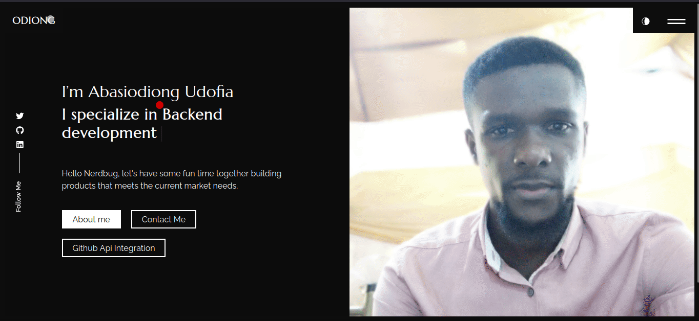

### Description

A portfolio CV built with React. 

### [live preview](https://udofia2.github.io/frontend/)

### Features

- Home Page
- Portfolio Page
- About Page
- Contact Form With EmailJs
- Github API integration

### Setup

Get the code

<pre>git clone https://github.com/udofia2/frontend.git</pre>
 
Install required dependencies

<pre>yarn install</pre>

Start the server

<pre>yarn start</pre>
